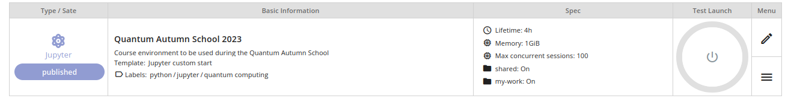
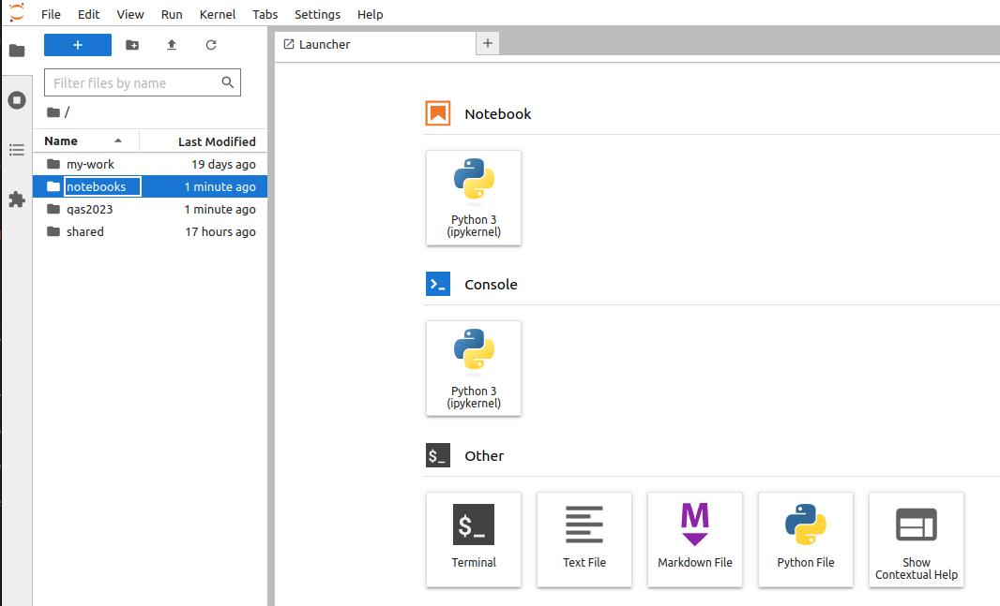

# Setup

Students can follow along with the course notebooks either on their laptop or via [notebooks.csc.fi](https://notebooks.rahtiapp.fi/welcome).

## Locally with your laptop

All of the course contents can be followed along locally on your laptop. Each tutorial will provide installation instructions. 

If you already have a preferred way to manage Python versions and libraries, you can stick to that. If not, we recommend that you install Python3 and all libraries using [`miniconda`](https://docs.conda.io/en/latest/miniconda.html) a free minimal installer for the package, dependency and environment manager for [`conda`](https://docs.conda.io/en/latest/index.html>).

Please follow the installation instructions on [https://docs.conda.io/en/latest/miniconda.html](https://docs.conda.io/en/latest/miniconda.html) to install Miniconda3.

Make sure that both Python and conda are correctly installed:

```console
$ python --version
$ # should give something like Python 3.10.13
$ conda --version
$ # should give something like conda 23.7.2
```

A `requirements.txt` file is provided which contains all of the python packages to install a local software environment on your computer. Using this a `conda` environment can be created using the command:

```console
$ conda create --name qas2023 -y python=3.10 pip
```

Which creates a new conda environment with Python 3.10 and `pip`. You can then activate it and install the python packages:

```console
$ conda activate qas2023
$ pip install -r requirements.txt
```

You can download the `requirements.txt` [here](requirements.txt).

## [Notebooks.csc.fi](https://notebooks.rahtiapp.fi/welcome)

CSC's notebooks platform provides a preconfigured python environment and jupyter-lab server for running all of the jupyter notebooks shown in this course. **No setup is required** to run the notebooks. User documentation on the notebooks platform can be found [here](https://docs.csc.fi/cloud/csc_notebooks/guide_for_students/).

```{note}
For running any of the tutorials on Helmi, Finland's 5-qubit quantum computer, the `notebooks.csc.fi` platform is required to be used.
```

Students and instructors can log in with either their CSC account or HAKA federated account if they have one, otherwise a training account will be provided before the start of the Quantum Autumn School. A join code will be given for the Quantum Autumn School which can be used once logged in by clicking "Join workspace" in the top right corner. Once you have joined the workspace, you will have access to the Quantum Autumn School workspace, and clicking the "Start a session" button will launch your jupyter notebooks server. 


*The Quantum Autumn School application. It can be launched by clicking the launch button.*



*Once launched the application screen should look like this. The notebooks folder contains notebooks from the [Github](https://github.com/ENCCS/qas2023) page. To view the rest of the course contents view the `qas2023` folder.*

### Data persistance 

As described in [CSC's documentation](https://docs.csc.fi/cloud/csc_notebooks/data_persistence/), some notebooks and data are persisted across the days of the School. To save your progress and modifications made to the notebooks during the tutorials it is recommended to copy your notebooks to the `my-work` directory. If instructors wish to share notebooks and data with the rest of the course files can be added to the `shared` directory. Changes made to files in directories other than `my-work` for students and `shared` for instructors will not persist across sessions. 
